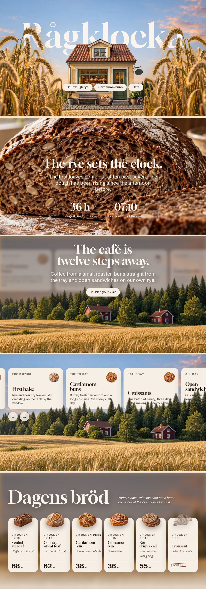
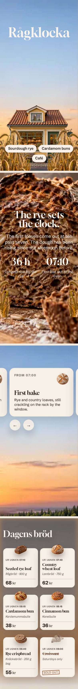

# Umbraco + Vue headless demo

A small client-style website built the way an agency would build it: Umbraco 17 (LTS) holds the content, and a Vue 3 + TypeScript frontend renders it through the Content Delivery API. The site belongs to Rågklocka, a made-up sourdough bakery and café. SQLite keeps setup to zero, and the content model, photos and pages are created in code on first boot.

**Rågklocka is fictional.** The name, address, phone number and email are invented for this demo (the phone number is from the range Sweden reserves for fiction, the email uses the reserved `.example` domain). I searched for the name before using it and found no bakery or café called Rågklocka. No real people, reviews or testimonials appear on the site.

Built by Rickard Lindbom · Lindforge Digital Studio · [Available for contract work](https://portfolio-rick.vercel.app/work-with-me)





## What it demonstrates

- Content model in code. `backend/Seeding/SchemaSeeder.cs` creates a page composition (meta description, hide from navigation), nine block element types, a Block Grid, a Block List for the bake board rows and five document types: Home, Content page, News list, News item and Contact page. Site settings (name, logo text, tagline, address, opening hours, phone, email, map link, footer note) live in their own tab on the Home node. Every step is get-or-create, so the seeder runs on each boot without changing anything that already exists.
- Block Grid to Vue components. The Block Grid (not Block List) has a hero, a bake board, a story, rich text, image, quote, card row and card. The card row has a `cards` area that only accepts cards, and the flexible blocks have column span options (rich text at 12, 8 or 6 columns). `BlockGrid.vue` maps each element type alias to one component, packs items into rows the way Umbraco does, and lets the hero, bake board and story bleed to the page edges. Blocks the frontend does not know are skipped instead of breaking the page.
- A bake board. "Dagens bröd" lists today's bakes with the time each batch came out of the oven, the price in SEK and a sold-out flag. The rows are a Block List inside the block, so staff can reorder them or mark a bake as sold out without touching the page layout. It renders as a table styled like a printed price list.
- Navigation from the content tree. The main menu is the root's children from the Delivery API, in backoffice sort order, minus pages with "Hide from navigation" ticked. Nothing is hard-coded.
- Routes resolved from content paths. The router has one catch-all route. `PageResolver.vue` fetches the item at the current path and picks the page component from its content type, so editors own the URLs and the page templates follow the document types.
- Media through the Delivery API. Nine photos are imported into the media library on first boot, with alt text in a property added to the Image media type. The frontend asks for them by media URL with a named preset (`wide`, `standard`, `square`, `original`) and a width from a fixed list, and builds `srcset` from those.
- Signed image presets. Umbraco 17 signs image processing URLs with an HMAC key, which a browser app cannot know. `backend/Imaging/ImagePresetMiddleware.cs` turns `?preset=standard&width=800` into a signed ImageSharp query on the server. Only the listed presets and widths exist, so nobody can ask the server for arbitrary resizes.
- A small Delivery API extension. `backend/DeliveryApi/PublishDateSortHandler.cs` indexes the news publish date and adds `sort=publishDate:desc`, so the news list is ordered by date rather than by tree position.
- Typed API client. `frontend/src/api/` holds the response types and the only module that calls `fetch`. Blocks and pages are discriminated unions on `contentType`, so the compiler points at every place a schema change touches.
- Accessibility basics. Alt text from the media library, a skip link, visible focus states, `aria-current` in the menu, labelled form fields and text colours that pass WCAG AA contrast.

The contact form is a demo. It validates and says thanks, but nothing is sent or stored.

## Architecture

```
 Editors                                        Visitors
    |                                               |
    v                                               v
+--------------------------------+   +--------------------------------+
| Umbraco 17 backoffice          |   | Vue 3 + Vite frontend          |
|                                |   |                                |
| Seeding/  (runs on boot)       |   | router.ts: one catch-all route |
|   SchemaSeeder   content model |   | PageResolver.vue               |
|   MediaSeeder    photos + alt  |   |   home        -> HomePage      |
|   ContentSeeder  pages, blocks |   |   contentPage -> ContentPage   |
|                                |   |   newsList    -> NewsListPage  |
| Block Grid "Page Blocks"       |   |   newsItem    -> NewsItemPage  |
|   hero, bakeBoard, story,      |   |   contactPage -> ContactPage   |
|   richText, image, quote,      |   |                                |
|   cardRow[cards: card]         |   | BlockGrid.vue: alias -> block  |
|                                |   | api/client.ts  (fetch)         |
| Content Delivery API v2        |<--| api/types.ts   (types)         |
|   /umbraco/delivery/api/v2     |   | api/media.ts   (image presets) |
|   + publishDate sort handler   |   +--------------------------------+
|                                |          |
| /media/*  ImagePresetMiddleware|<---------+  JSON and images over HTTP
|   -> signed ImageSharp request |             (Vite proxy in dev/preview)
+---------------+----------------+
                |
                v
     SQLite database + media files
     (umbraco/Data, wwwroot/media, both gitignored)
```

## Requirements

- .NET 10 SDK
- Node.js 20.19+ or 22.12+ (required by Vite 8)

## Run it

1. Start the CMS. The first run installs Umbraco into a local SQLite file, imports the photos and publishes the site.

   ```bash
   cd backend
   cp appsettings.Local.example.json appsettings.Local.json
   # edit appsettings.Local.json and set your own admin email and password (10+ characters)
   dotnet run
   ```

   The backoffice is at http://localhost:60733/umbraco. Sign in with the credentials from `appsettings.Local.json`.

   You can also pass the install settings as environment variables and skip the file, for example `Umbraco__CMS__Unattended__UnattendedUserPassword`.

2. Start the frontend in a second terminal.

   ```bash
   cd frontend
   npm install
   npm run dev
   ```

   Open the URL Vite prints (usually http://localhost:5173). Requests to `/umbraco/*` and `/media/*` are proxied to the CMS. Set `UMBRACO_URL` if the CMS runs on a different address.

On a fresh install Umbraco builds the Delivery API search index in the background. The menu and news list can be empty for up to a minute after the first boot; pages fetched by path work straight away.

To start over, stop the CMS and delete `backend/umbraco/Data` and `backend/wwwroot/media`.

## Try the API directly

```text
# the root page, with site settings
http://localhost:60733/umbraco/delivery/api/v2/content/item/
# top-level pages for the menu
http://localhost:60733/umbraco/delivery/api/v2/content?fetch=children:/&fields=properties[hideFromNavigation]
# news, newest first, with image alt text
http://localhost:60733/umbraco/delivery/api/v2/content?fetch=children:/news/&sort=publishDate:desc&expand=properties[image]
# one page, with alt text for images inside its blocks
http://localhost:60733/umbraco/delivery/api/v2/content/item/our-bread/?expand=properties[blocks[properties[image]]]
```

## Build

```bash
dotnet build            # from the repo root, uses HeadlessDemo.sln
cd frontend && npm run build
```

For a production frontend build that talks to a CMS on another origin, set `VITE_UMBRACO_URL` at build time and allow that origin with CORS on the Umbraco side. The imaging HMAC key in `appsettings.json` is the one generated for this demo; set your own through configuration for anything real.

## Project layout

```
backend/
  Program.cs                           Umbraco host with AddDeliveryApi() and the image preset middleware
  Seeding/SiteSeeder.cs                startup handler that runs the three seeders
  Seeding/SchemaSeeder.cs              document types, element types, Block Grid, Block List
  Seeding/MediaSeeder.cs               imports Seeding/Media/*.jpg with alt text
  Seeding/ContentSeeder.cs             pages, news items and their blocks
  Seeding/BlockGridValue.cs            Block Grid storage format (layout, areas, contentData)
  Seeding/Media/                       the photos (see Credits)
  Imaging/ImagePresetMiddleware.cs     signs preset image requests
  DeliveryApi/PublishDateSortHandler.cs  publishDate index field and sort
frontend/
  src/api/                             types, typed client, image preset URLs
  src/pages/PageResolver.vue           path -> content item -> page component
  src/pages/                           one component per document type
  src/components/BlockGrid.vue         block alias to component registry
  src/components/blocks/               one component per block element type
  src/components/layout/               header (menu from the tree) and footer
  vite.config.ts                       dev and preview proxy to the CMS
```

## Credits

The photos in `backend/Seeding/Media/` are from [Unsplash](https://unsplash.com) and used under the [Unsplash License](https://unsplash.com/license), which allows free use without permission. Each one was downloaded, resized to 1600 px wide and recompressed, and is stored in `backend/Seeding/Media/`.

| File | Photographer | Source |
| --- | --- | --- |
| `hero-flour.jpg` | Yana ([@yana_bjorn](https://unsplash.com/@yana_bjorn)) | https://unsplash.com/photos/person-pouring-water-on-round-brown-plastic-basin-RLyTrOHxH9s |
| `loaf.jpg` | Gustavo Sánchez ([@gustavo0351](https://unsplash.com/@gustavo0351)) | https://unsplash.com/photos/a-loaf-of-bread-sitting-on-top-of-a-wooden-cutting-board-pCney1f3G_A |
| `kneading.jpg` | DDP ([@moino007](https://unsplash.com/@moino007)) | https://unsplash.com/photos/a-person-kneading-dough-on-top-of-a-wooden-table-5CRzqqWzEKQ |
| `cafe-interior.jpg` | Amy Vosters ([@amyvosters](https://unsplash.com/@amyvosters)) | https://unsplash.com/photos/a-restaurant-with-tables-and-chairs-and-a-counter-WdE9JhjDb0M |
| `rye-field.jpg` | Natasha Arefyeva ([@nely_snork](https://unsplash.com/@nely_snork)) | https://unsplash.com/photos/brown-wheat-field-during-daytime-SwTvusNIJGw |
| `cardamom-bun.jpg` | Chris Curry ([@chriscurry92](https://unsplash.com/@chriscurry92)) | https://unsplash.com/photos/a-white-plate-topped-with-pastries-on-top-of-a-wooden-table-M5XHo05kO78 |
| `cinnamon-bun-coffee.jpg` | Fallon Michael ([@fallonmichaeltx](https://unsplash.com/@fallonmichaeltx)) | https://unsplash.com/photos/baked-bread-in-plate-beside-cappuccino-H6OBZaVveCA |
| `croissants.jpg` | Conor Brown ([@commonboxturtle](https://unsplash.com/@commonboxturtle)) | https://unsplash.com/photos/a-bunch-of-croissants-that-are-on-a-table-sqkXyyj4WdE |
| `coffee.jpg` | Daniel Seßler ([@danielsessler](https://unsplash.com/@danielsessler)) | https://unsplash.com/photos/two-cups-of-coffee-sitting-on-top-of-a-wooden-table-wYKEz3GPdCA |

The scene layers, product images and icons in `backend/Seeding/Media/Layers/` were generated with OpenAI's image generation (via the Codex CLI) for this demo. They are not photographs.

Fonts: [Gloock](https://fonts.google.com/specimen/Gloock) and [Schibsted Grotesk](https://fonts.google.com/specimen/Schibsted+Grotesk), both under the SIL Open Font License, self-hosted through Fontsource.

## License

Code: MIT. See [LICENSE](LICENSE). The photos stay under the Unsplash License and the fonts under the SIL Open Font License.
